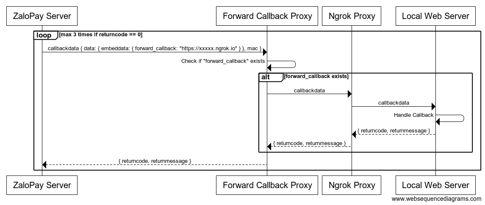

# ZaloPay Forward Callback Proxy

Nhận callback từ ZaloPay server và chuyển tiếp cho môi trường local, chờ kết quả từ môi trường local và trả về cho ZaloPay server.



## Cấu hình

1. Deploy forward-callback-proxy lên host
2. Đăng ký callback url với ZaloPay
   * Ví dụ: https://example.com/forward-callback-proxy.php
3. Cài đặt [ngrok](https://ngrok.io) cho môi trường local

## Sử dụng

Sau khi đã cấu hình xong, ở môi trường local dùng ngrok để tạo public url

```bash
ngrok http [port] # Public url hết hạn trong 8 tiếng
```

Tiến hành lấy public url thông qua api của ngrok

```bash
http://localhost:4040/api/tunnels
```

Response nhận được có dạng:

```json
{
  "tunnels": [
    {
      "public_url": "https://xxxx.ngrok.io",
    },
  ],
}
```

Khi gọi API tạo đơn hàng cần thêm trường `forward_callback` vào `embeddata` của đơn hàng như sau

```json
{
  "embeddata": {
    "forward_callback": "https://xxxxx.ngrok.io/[callback-path]"
  }
}
```

## Ví dụ lấy public url cho một số ngôn ngữ

**PHP**

```php
$res = file_get_contents("http://localhost:4040/api/tunnels");
$data = json_decode($res, true);
$publicURL = $data["tunnels"][0]["public_url"];

echo $publicURL;
```

**Javascript**

```javascript
const axios = require('axios').default;

(async GetPublicURL() {
  const { data } = await axios.get('http://localhost:4040/api/tunnels');
  const publicURL = data.tunnels[0].public_url;
  
  console.log(publicURL);
})();
```

**Python**

```python
import urllib.request
import json

res = urllib.request.urlopen(url='http://localhost:4040/api/tunnels')
data = json.loads(res.read().decode())
public_url = data['tunnels'][0]['public_url']

print(public_url)
```

**Golang**

```golang
import (
  "net/http"
  "io/ioutil"

  "github.com/tidwall/gjson"
)

res, _ := http.Get("http://localhost:4040/api/tunnels")

defer res.Body.Close()

body, _ := ioutil.ReadAll(res.Body)

data := string(body)
publicURL := gjson.Get(data, "tunnels.0.public_url").String()

print(publicURL)
```